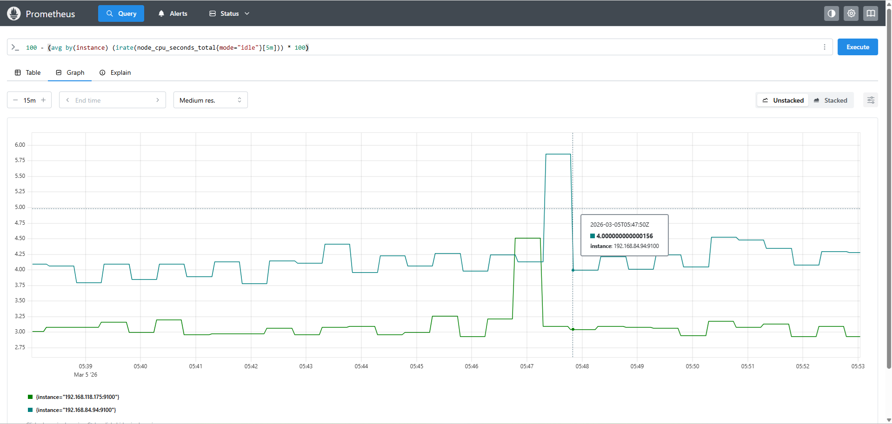
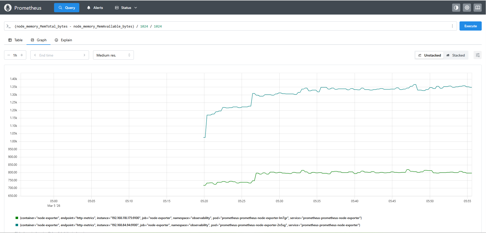
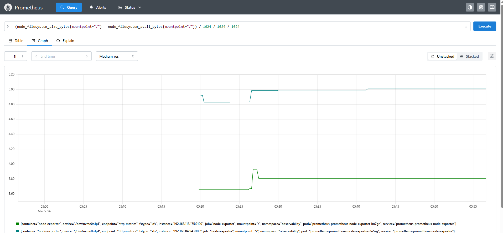
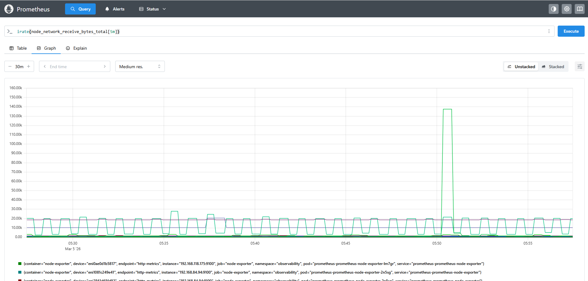
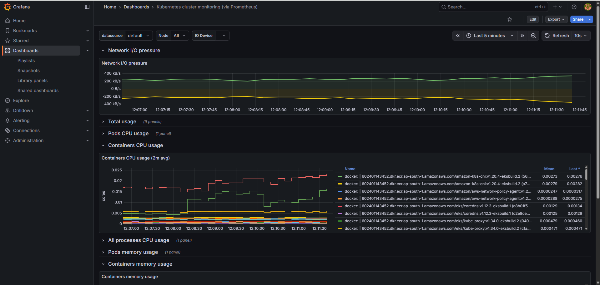
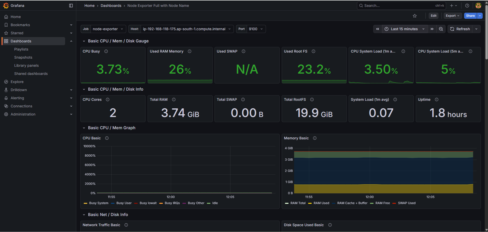
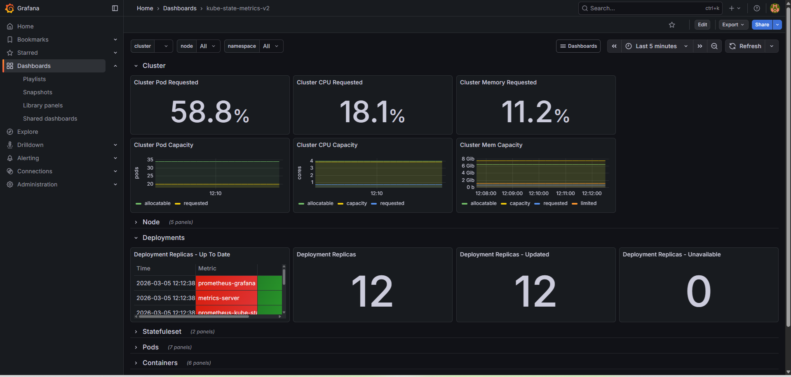

# Kubernetes Observability Stack

## 📌 Project Overview

This project demonstrates a production-style observability stack deployed on Kubernetes.

It integrates metrics, logs, and distributed tracing using:

- OpenTelemetry (Instrumentation & Telemetry Collection)
- Prometheus (Metrics Storage & Alerting)
- Grafana (Visualization & Dashboards)
- Jaeger (Distributed Tracing)
- EFK Stack (Elasticsearch, Fluentd, Kibana for Logging)

The goal of this project is to simulate a real-world microservices environment and showcase how observability reduces Mean Time To Recovery (MTTR).

---

## 🏗 Architecture Overview

Application → OpenTelemetry Collector →

• Metrics → Prometheus → Grafana  
• Traces  → Jaeger  
• Logs    → Fluentd → Elasticsearch → Kibana  

All components are deployed inside a dedicated `observability` namespace.

---

## 🔍 Observability Signals Covered

| Signal  | Tool Used | Purpose |
|----------|------------|----------|
| Metrics | Prometheus | Monitor system health & trigger alerts |
| Logs | EFK Stack | Centralized log aggregation |
| Traces | Jaeger | End-to-end request tracking |

---

## 📁 Project Structure

k8s-observability-demo/  
│  
├── README.md  
├── architecture-diagram.png  
│  
├── eks-cluster-setup/  
│   └── README.md  
│
├── installation/  
│   └── README.md  
│  
├── infrastructure/  
│   ├── namespace.yaml  
│   │  
│   ├── prometheus/  
│   │   ├── custom-kube-prometheus-stack.yaml  
│   │   └── kustomization.yaml  
│   │  
│   ├── grafana/  
│   │   ├── values.yaml  
│   │   └── datasource-config.yaml  
│   │  
│   ├── jaeger/   
│   │   ├── values.yaml  
│   │   └── ingress.yaml  
│   │  
│   ├── efk/  
│   │   ├── elasticsearch-values.yaml  
│   │   ├── fluentd-daemonset.yaml  
│   │   └── kibana-values.yaml  
│   │  
│   └── opentelemetry/  
│       ├── otel-collector-config.yaml  
│       └── otel-collector-deployment.yaml  
│  
├── app/  
│   ├── Dockerfile  
│   ├── app.py  
│   ├── deployment.yaml  
│   └── service.yaml  
│  
├── dashboards/  
│   └── grafana-dashboard.json  
│  
└── alerts/  
    └── prometheus-alert-rules.yaml  

---

## 🚀 Getting Started

Refer to:

installation/README.md

---

## 📊 Observability Features

- Application-level instrumentation using OpenTelemetry
- Metrics collection via Prometheus
- Custom Grafana dashboards
- Distributed tracing via Jaeger
- Centralized logging using EFK
- Alerting rules for CPU, memory, and error rates

---

## 🧠 Key Concepts Demonstrated

- Kubernetes Deployments & Services
- Helm-based installation
- Telemetry pipelines
- Alert rule configuration
- Log aggregation
- Distributed tracing
- Production debugging workflow

---

# Screenshots

## Prometheus Screenshots
<table>
<tr><td>CPU usage percentage per node</td><td>used memory (RAM) of a node in MB</td></tr>
<tr>
<td>

</td>
<td>

</td>
</tr>
<tr><td>used disk space of the root filesystem (/) in GB</td><td>incoming network traffic rate (bytes received per second) on a node</td></tr>
<tr>
<td>

</td>
<td>

</td>
</tr>
</table>

## Grafana Screenshots

<table>
<tr><td>Kubernetes cluster monitoring</td></tr>
<tr>
<td>

</td>
</tr>
<tr><td>Kube state metrics</td><td>Node Exporter</td></tr>
<tr>
<td>

</td>
<td>

</td>
</tr>
</table>

## 🔥 Future Enhancements

- SLI / SLO implementation
- Slack alert integration
- CI/CD pipeline
- Deployment on AWS EKS

---

## 👨‍💻 Author

Abhisheka B  
DevOps Engineer | Kubernetes | Observability
